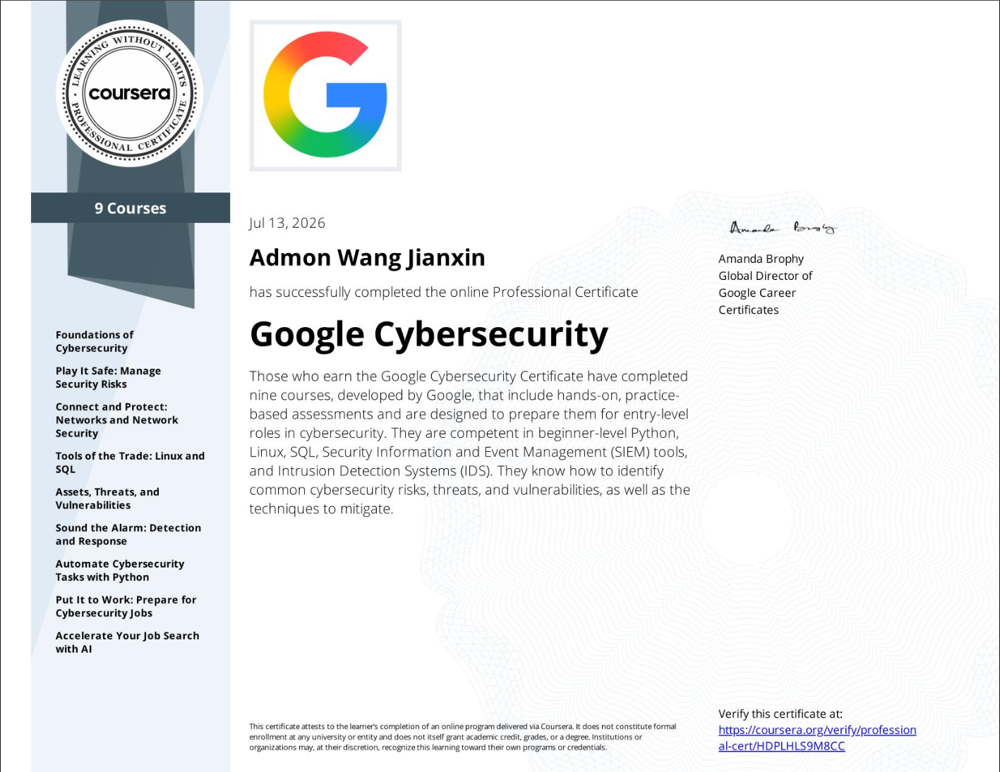

# Google Cybersecurity Certificate: Technical Portfolio

This directory holds the hands-on projects I built while completing the Google Cybersecurity Professional Certificate. 

Instead of writing out high-level conceptual notes or textbook definitions, I chose to focus entirely on documenting actionable, production-ready engineering assets. Prioritizing database log auditing through SQL and access automation with Python shows functional operational skills and real engineering workflows over passive text memorization.

---

## Technical Artifacts

### 1. **[SQL Log Analysis](./SQL_Log_Analysis.md)** 
A practical case study focused on log analysis and incident response. This project shows how to query login records and corporate asset databases to track down suspicious activity patterns—including after-hours failed login attempts, potential brute-force windows, unauthorized geographic traffic, and segmenting company workstations for targeted security patching.

*   **Core Focus:** Database queries, log analysis, threat detection, incident isolation.

### 2. **[Automated Access Control](./Automated_Access_Control.md)**
A Python automation script used to enforce programmatic access control. The program automates the removal of unauthorized IP addresses from a network registry file, demonstrating how to safely open, parse, process, and overwrite data structures to maintain the Principle of Least Privilege.

*   **Core Focus:** Python script automation, file parsing, access control enforcement, script efficiency.

---

*Portfolio last updated: 2026-07-16*
